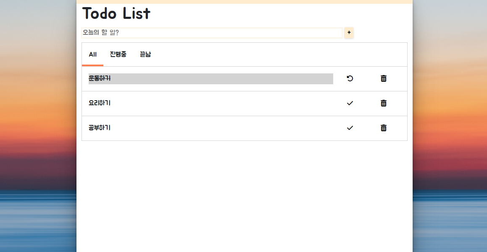

# TODO LIST
:point_right:아이템을 추가, 제거하고 상태별로 확인할 수 있는 앱

:clapper: 데모앱: [todolist](https://todolist-std.netlify.app/)
## :memo:기능
+ 유저가 input에 값을 입력한다
+ plus버튼을 클릭하면, 할 일이 추가된다
+ delete버튼을 누르면 할 일이 삭제된다
+ check버튼을 누르면 할 일이 끝나면서 밑줄이 그어진다
+ All, 진행중, 끝남 탭을 누르면, 언더바가 이동한다
+ 탭을 이용해 아이템들을 상태별로 확인 할 수 있다
+ 반응형 UI

## :hammer:사용한 기술
+ HTML
+ CSS
+ Vanila Javascript
